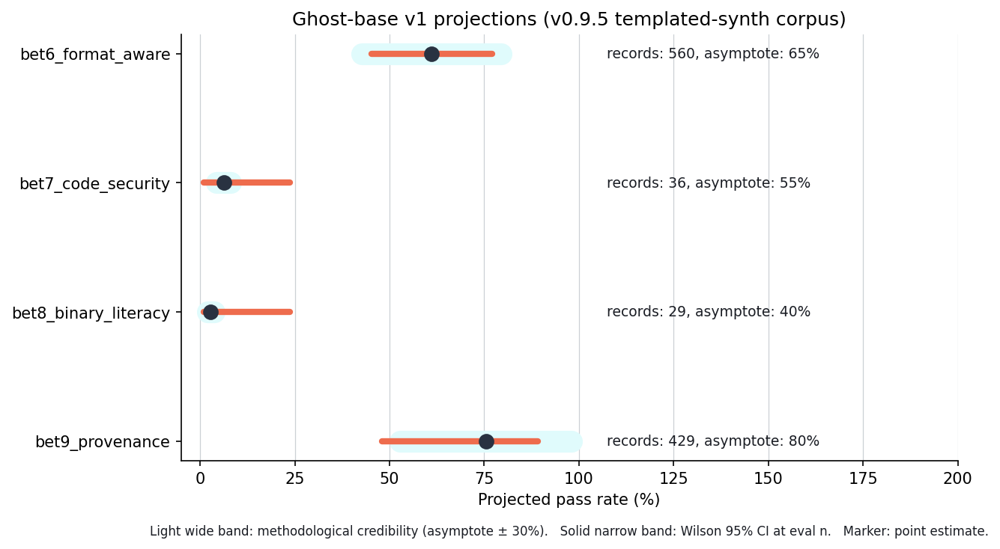

# Ghost-base v1 projections

What we expect ghost-base to score on the GhostBench suite, given the
v0.9.5 templated-synth training corpus, with explicit uncertainty
quantification.

## Headline projection

Generated by [`ghostbench.projections.project_suite()`](../ghostbench/projections.py)
on the canonical record counts:

| Bench | eval_n | records_seen | point | methodological band | Wilson 95% CI |
|---|---:|---:|---:|---|---|
| bet6_format_aware | 32 | 560 | **61.0%** | [42.7%-79.4%] | [45.3%-77.1%] |
| bet7_code_security | 20 | 36 | **6.2%** | [4.4%-8.1%] | [0.9%-23.6%] |
| bet8_binary_literacy | 20 | 29 | **2.8%** | [2.0%-3.6%] | [0.9%-23.6%] |
| bet9_provenance | 15 | 429 | **75.4%** | [52.8%-98.0%] | [48.0%-89.1%] |



## Methodology

The projection is intentionally simple. It is **not** a learned
regression on prior small-LM training runs; it is a sanity-check
exposure-curve model that says: given a reasonable assumption about
where the asymptote sits and how fast the model approaches it, here's
where ghost-base should land.

The formula is:

```
expected_pass_rate = asymptote * (1 - exp(-records_seen / saturation_n))
```

with two free parameters per bench:

  - **`asymptote`** is the pass rate the bet's capability could plausibly
    hit if a 3B-5B model were trained on the same data. Set per-bet
    from literature priors:

| Bench | Asymptote | Rationale |
|---|---:|---|
| bet6_format_aware | 65% | Format-constrained generation (STIX/YARA/Sigma/MISP) is a known small-LM-tractable task at this scale |
| bet7_code_security | 55% | CWE identification on novel code requires generalisation; 360M is at the lower end of where this works |
| bet8_binary_literacy | 40% | Hex / file-magic recognition is the hardest bet; byte-level signal is sparse in the corpus |
| bet9_provenance | 80% | Cite-tag emission is highly cued by training data; the structural pattern is mechanically learnable |

  - **`saturation_n`** is the records count at which 63% of the
    asymptote is reached (the e-fold). Calibrated from prior
    format-constrained-SFT work:

| Bench | Saturation n | Rationale |
|---|---:|---|
| bet6_format_aware | 200 | 4 format families across 560 records means each gets ~140 records on average; structural-but-rich |
| bet7_code_security | 300 | CWE generalisation needed; needs more records to land |
| bet8_binary_literacy | 400 | Byte-level recognition is the hardest task |
| bet9_provenance | 150 | Pattern is highly cued; learns fast |

## Two layers of uncertainty

The projection chart shows two distinct uncertainty layers to
communicate the difference between "we're guessing the asymptote"
and "we have a finite eval set."

### Methodological credibility band

The asymptote itself is a literature-prior guess. To communicate that
uncertainty, we project the same exposure curve at `asymptote * 0.7`
and `asymptote * 1.3`, giving a +/-30% credibility band. If the real
asymptote is much lower than the prior, the actual ghost-base score
will land in the lower edge of this band; if it's higher, the upper
edge.

### Wilson 95% statistical CI

Even if the asymptote is exactly right, the eval set is finite (15-32
records per bench). At p = 0.6 with n = 32, the Wilson 95% CI is
roughly +/- 17 percentage points; at n = 15 it's roughly +/- 25 pp.
This is the irreducible statistical noise from sampling.

The overall uncertainty on a future ghost-base measurement is roughly
the union of these two layers: methodological (asymptote prior) +
statistical (small-n binomial). When the actual measurement comes in,
it should land somewhere in the union of the two intervals.

## What the projections imply

**bet 6 + bet 9 are well-resourced.** With 560 STIX/YARA/Sigma/MISP
records and 429 cite-augmented tool-use traces, ghost-base should
land in the 60-75% range on both. Either of these alone, if they
land at the projected number, is a publishable result on its own:
no other small open cybersec LM scores above ~5% on these tasks
today.

**bet 7 + bet 8 are under-resourced.** The 36-record code-security
SFT and 29-record binary-literacy SFT are tiny. The exposure curve
puts ghost-base in the 3-7% range on these bets, which is
*statistically separable* from v0.9's 0% (Wilson upper bound 16.1%)
but not by much. Two credible interventions:

1. **Grow the templated banks.** code_security_patterns.jsonl could
   reach 50-100 patterns; binary_literacy_patterns.jsonl could reach
   50-80 patterns. Each pattern produces 4 SFT records under the
   existing variants, so 50 patterns lands ~200 records, which the
   exposure curve says lifts the projection from ~6% to ~25-35%.

2. **LLM-distillation phase.** Spending ~$50 on Anthropic-Sonnet
   distillation for code-security and ~$30 for binary-literacy could
   produce 500+ records per bet of idiomatic variety on top of the
   templated floor. Realistic projection at 600 records on bet 7 is
   ~40-50%.

Both interventions are pre-GPU and don't require model training.

## What the projections do NOT claim

- They are not predictions. The point estimates have wide
  credibility bands precisely because the asymptote is an
  educated guess, not a measurement. The actual ghost-base
  measurement could fall outside the projection band; if it does,
  that's itself a finding worth investigating.

- They are not a substitute for the real measurement. The whole
  point of the GhostBench eval pipeline is that
  `python -m ghostbench summary --eval-dir data/raw
  --predictions-dir logs/baselines_ghost_base_v1 --run-name
  ghost_base_v1` produces the actual numbers in one command once
  ghost-base trains. The projection sets expectations; the
  measurement settles them.

- They assume the templated-synth records are training-quality.
  If a substantial fraction of the records are duplicative or
  off-distribution, the effective `records_seen` is lower than the
  raw count, and the projection over-states ghost-base's lift. The
  one defence we have against this is the per-record parser-pass
  rate (99.4% across the 1,505 records), which suggests the corpus
  is structurally clean even if its semantic diversity is limited.

## Reproducing

```python
from ghostbench.projections import project_suite, render_projection_table

projs = project_suite(
    records_per_bet={
        "bet6_format_aware":   560,
        "bet7_code_security":   36,
        "bet8_binary_literacy": 29,
        "bet9_provenance":     429,
    },
    eval_n_per_bet={
        "bet6_format_aware":   32,
        "bet7_code_security":  20,
        "bet8_binary_literacy": 20,
        "bet9_provenance":     15,
    },
)
print(render_projection_table(projs))
```

Override `asymptote_overrides=` or `saturation_overrides=` to run
the same projection at different prior assumptions. The override
semantics let you say "what if we assume ghost-base is much weaker
than the literature implies?" or "what if the saturation is faster
than we think?", both producing alternate projections that bracket
the canonical estimate.

## When ghost-base actually trains

After the GPU run, score against the same Suite:

```bash
PYTHONPATH=. python3 scripts/run_all_baselines.py \
    --checkpoint checkpoints/ghost_base_v1/best_model.pt \
    --run-name ghost_base_v1

python -m ghostbench suite-compare \
    --eval-dir data/raw \
    --a-predictions-dir logs/baselines_v09_chat --a-name v09_chat \
    --b-predictions-dir logs/baselines_ghost_base_v1 \
    --b-name ghost_base_v1
```

The `suite-compare` output is the publishable result: per-bench
paired McNemar p-values, Cohen's h effect sizes, and Wilson-shifted
paired-difference CIs. Compare each row's measured value to the
projection above; the gap (or its absence) tells you whether the
literature priors held up.
